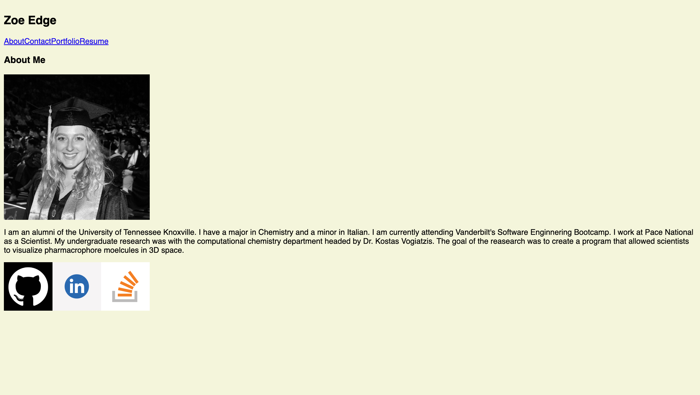

# react-portfolio

## Description
This portfolio was created using react.js methods. This application allows for the viewing of a software engineers resume, about me, contact, and projects. This allows for employeers to get a better handle on the current level the software engineer is at 

## Technologies

[Vite](https://vitejs.dev/)

[Netlify](https://www.netlify.com/)

## ScreenShot

